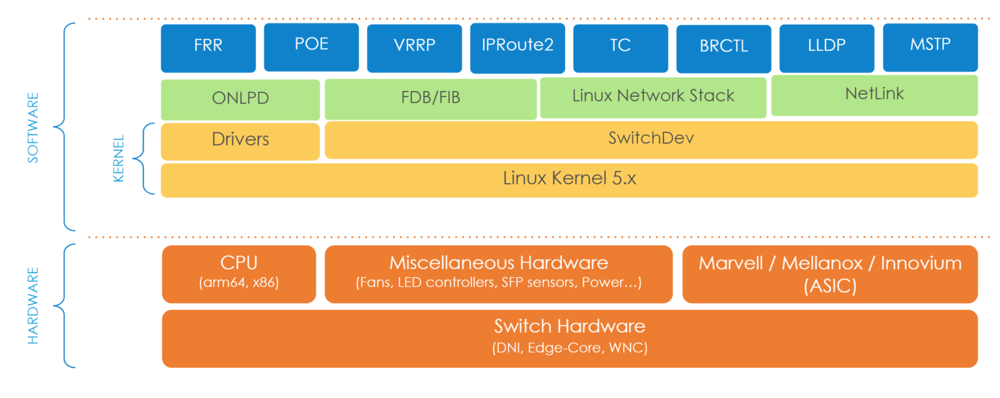

# Documentation guide for developers

This document will serve as a guide for developers that want to build and modify DentOS.
This documentation is intended as a guideline for developers, not end users. It is also intended for developers who would like to include a derivative package for their customers.

DentOS is a Network Operating System (NOS) that is based on switchdev and built on top of Open Network Linux. 
Switchdev is an Ethernet switch device driver model which integrated networking hardware in the Linux ecosystem. 

dentOS is maintained by Dent Community and was initially born to fulfill the Amazon retail store needs.
switchdev is an infrastructure in the Linux kernel which facilitates the offloading of the kernel's forwarding plane to capable ASICs.

switchdev allows users and developers to utilize current ASICs by using a standardized and well-known API exposed by the Linux kernel instead of relying on proprietary APIs implemented in binary user space blobs.

For more information about DENT please refer to https://www.dent.dev.

For more information about Open Network Linux please refer to http://opennetlinux.org.

For more information about switchdev please refer to the kernel's Switchdev documentation.

# DentOS
## Features by version

|DentOS Version |Content    |Supported platforms |
|---------------|:----------|:-------------------|
| 1.0 | "Arthur" Release feature list in the [Roadmap](https://dent.dev/dent-os/#Roadmap) section |  [Hardware](Hadrware.md) |
| 2.0 | "B" Release feature list in the [Roadmap](https://dent.dev/dent-os/#Roadmap) section | [Hardware](Hadrware.md) |
